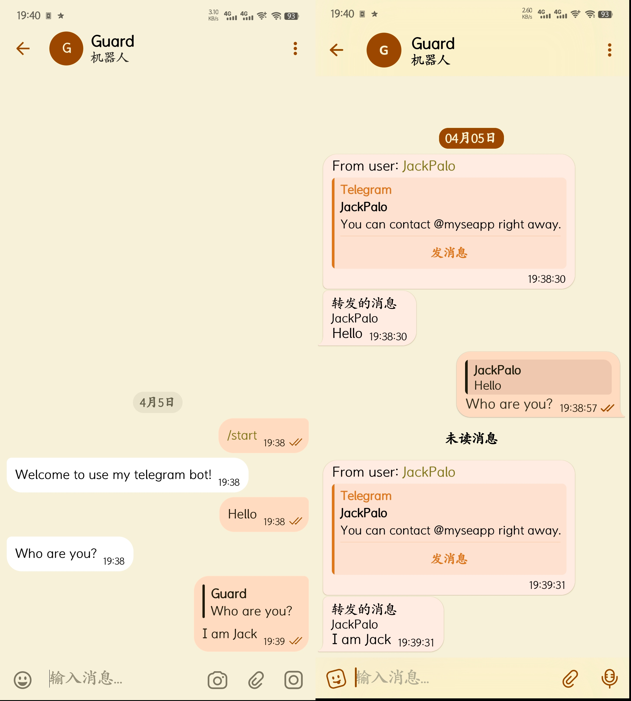

# User Instructions



#### Clone project to local

```bash
git clone https://github.com/Bubble-droid/Telegram-Message-Relay.git
cd Telegram-Message-Relay
```

#### Install dependencies

```bash
npm install
```

#### Install Wrangler CLI

```bash
npm install -g @cloudflare/wrangler
```

#### Log in to the Cloudflare account

```bash
wrangler login
```

#### Create kV namespace

```bash
wrangler kv namespace create MESSAGE_FROM_CHAT_ID
```

#### Configure wrangler.json

```json
{
    "vars": {
        "TELEGRAM_BOT_ID": "YOUR_BOT_ID",
        "TELEGRAM_BOT_NAME": "YOUR_BOT_NAME",
        "TELEGRAM_BOT_API": "https://api.telegram.org/bot",
        "TELEGRAM_BOT_TOKEN": "YOUR_BOT_TOKEN",
        "WEBHOOK_SECRET_TOKEN": "YOUR_SECRET_TOKEN",
        "TELEGRAM_BOT_OWNER_ID": "YOUR_TELEGRAM_ID",
        "TELEGRAM_BOT_WELCOME_TEXT": "Welcome to use my telegram bot!"
    },
    "kv_namespaces": [
        {
            "binding": "MESSAGE_FROM_CHAT_ID",
            "id": "YOUR_KV_ID"
        }
    ]
}
```

#### Deploy to Cloudflare Workers

```bash
wrangler deploy
```

#### Set Telegram WebHook

```bash
curl -X POST "https://api.telegram.org/bot<YOUR_BOT_TOKEN>/setWebhook" -d "url=<YOUR_WORKERS_URL>/webhook&secret_token=<YOUR_SECRET_TOKEN>"
```
